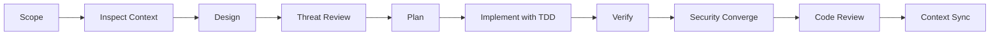

# Development Workflow

Mandatory workflow for building the Coding Agent itself.

The purpose is to prevent a security-sensitive agent project from evolving through ad-hoc implementation.

---

## Workflow Pipeline

```text
scope
  → inspect-context
  → design
  → threat-review
  → plan
  → implement-with-TDD
  → verify
  → security-converge
  → code-review
  → context-sync
```



---

## Step 1: Scope

Purpose:

Define exactly what is being built.

Required:

- user-visible behavior;
- security boundary affected;
- files/modules expected to change;
- explicit non-goals;
- acceptance criteria.

Gate:

No implementation before scope is understood.

---

## Step 2: Inspect Context

Read, in minimum order:

```text
context/project-overview.md
context/architecture.md
context/tool-policy.md
context/code-standards.md
context/library-docs.md
context/progress-checker.md
```

Then inspect the relevant production code and tests.

Rules:

- never implement from assumptions when repository evidence exists;
- identify existing abstractions before creating new ones;
- identify current test commands before writing code.

---

## Step 3: Design

For bounded changes, produce a compact design:

```text
problem
current behavior
proposed behavior
boundary changes
files affected
verification
```

For architectural changes include:

- component responsibilities;
- dependency direction;
- state transitions;
- failure modes;
- rollback or migration implications.

---

## Step 4: Threat Review

Any change involving tools, sandboxing, Git, credentials, network, filesystem, commands, or model context must answer:

1. What new capability is introduced?
2. Can model-controlled data reach a privileged sink?
3. Can path traversal or symlink escape occur?
4. Can command injection occur?
5. Can the change expose a secret?
6. Can repository content alter policy?
7. What happens if the security component crashes?
8. Is execution bounded?
9. Is the behavior auditable?
10. What test proves the boundary?

Gate:

New privilege without explicit policy and tests is rejected.

---

## Step 5: Plan

Create ordered implementation tasks.

Each task should define:

- expected behavior;
- exact files;
- failing test to write;
- minimal implementation;
- verification command.

Prefer vertical slices.

Example:

```text
T01 RED: unknown tool is denied
T02 GREEN: closed ToolRegistry lookup
T03 RED: path traversal rejected
T04 GREEN: WorkspaceBoundary canonicalization
```

---

## Step 6: Implement with TDD

For each behavior:

```text
RED
  Write one failing behavior/boundary test
  Run it and confirm expected failure

GREEN
  Implement the minimum correct behavior
  Run targeted test

REGRESSION
  Run relevant existing suite

REFACTOR
  Improve structure without changing behavior

DONE
  Mark task complete only when tests pass
```

### Tests Are Not an Escape Hatch

When production code fails a valid test:

- fix production code.

Do not:

- delete the test;
- skip the test;
- weaken assertions;
- change expected behavior to match the bug.

If the specification changed, document and approve the specification change first.

---

## Step 7: Verify

Minimum verification for ordinary changes:

```text
unit tests
integration tests
lint
typecheck
```

Security-sensitive changes additionally require:

```text
security/boundary tests
negative cases
fail-closed cases
```

Architectural changes require the relevant E2E/smoke suite.

---

## Step 8: Security Convergence

Compare implementation against:

```text
architecture invariants
tool-policy rules
threat review
acceptance criteria
```

Classify findings:

```text
CRITICAL
HIGH
MEDIUM
LOW
```

Blocking before completion:

```text
CRITICAL
HIGH
```

Recommended MVP rule: resolve MEDIUM findings affecting authorization, secrets, path handling, shell/process execution, or sandbox isolation before merge as well.

Repeat:

```text
review
 ↓
fix
 ↓
verify
 ↓
review
```

until no blocking findings remain.

---

## Step 9: Dual-Axis Code Review

Review on two axes.

### Standards / Security

Check:

- architecture boundaries;
- code standards;
- capability leaks;
- tool bypasses;
- fail-open paths;
- secret handling;
- path/command safety;
- auditability.

### Specification

Check:

- requested behavior;
- acceptance criteria;
- missing requirements;
- scope creep;
- changed public behavior.

Both reports remain distinct.

Gate:

No unresolved blocking findings.

---

## Step 10: Context Sync

A feature is incomplete if implementation changes project truth but context files remain stale.

Update when applicable:

```text
architecture.md
code-standards.md
library-docs.md
tool-policy.md
progress-checker.md
project-overview.md
```

Examples:

- new tool → update `tool-policy.md`, `architecture.md`, `library-docs.md`;
- new sandbox backend → update architecture/library docs;
- new security invariant → update standards + tool policy;
- completed milestone → update progress checker.

---

## Required Test Matrix

| Change Type | Unit | Integration | Security | E2E |
| --- | --- | --- | --- | --- |
| Pure utility | Required | Optional | If boundary-related | No |
| Policy engine | Required | Required | Required | Conditional |
| Tool | Required | Required | Required | Conditional |
| Sandbox | Required | Required | Required | Required |
| Orchestrator state | Required | Required | Boundary cases | Required |
| API transport | Required | Required | Auth/input cases | Conditional |
| Git provider | Required | Required | Required | Required |
| Network capability | Required | Required | Required | Required |

---

## Completion Checklist

A task is complete only when:

- scope is satisfied;
- no unauthorized extra behavior was added;
- tests pass;
- lint/typecheck pass where applicable;
- security boundaries have negative tests;
- no arbitrary shell path was introduced;
- no model-controlled authorization was introduced;
- audit events cover privileged actions;
- final diff has been reviewed;
- context documentation is synchronized.

---

## MVP Release Gate

Before calling the Coding Agent MVP usable:

1. Unknown tool call is denied.
2. Path traversal is denied.
3. Symlink escape is denied.
4. Network is disabled in sandbox.
5. Arbitrary shell is unavailable.
6. Tool execution has timeout.
7. Tool output has size bound.
8. Patch changes appear in Git diff.
9. Test execution works inside sandbox.
10. Agent loop terminates on budget exhaustion.
11. Policy failure is fail-closed.
12. Repository prompt injection cannot alter capabilities.
13. Audit record exists for every tool request and decision.
14. Full smoke task completes:
    `inspect → patch → test → diff → result`.
